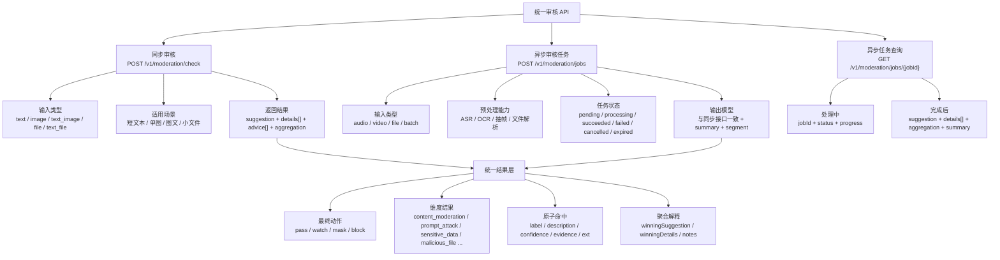
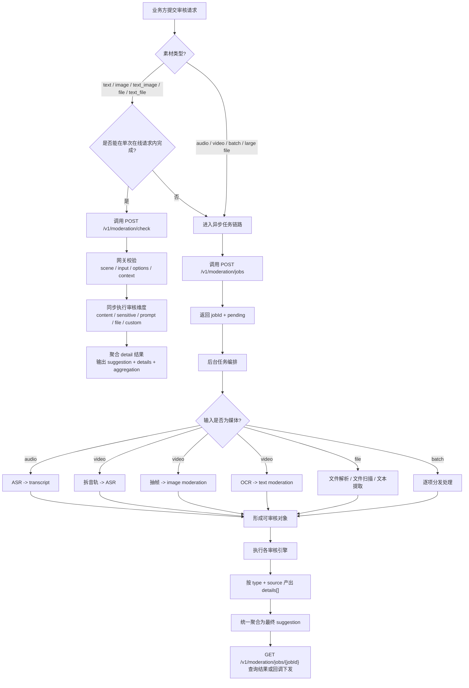
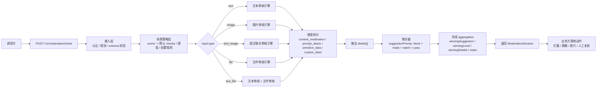
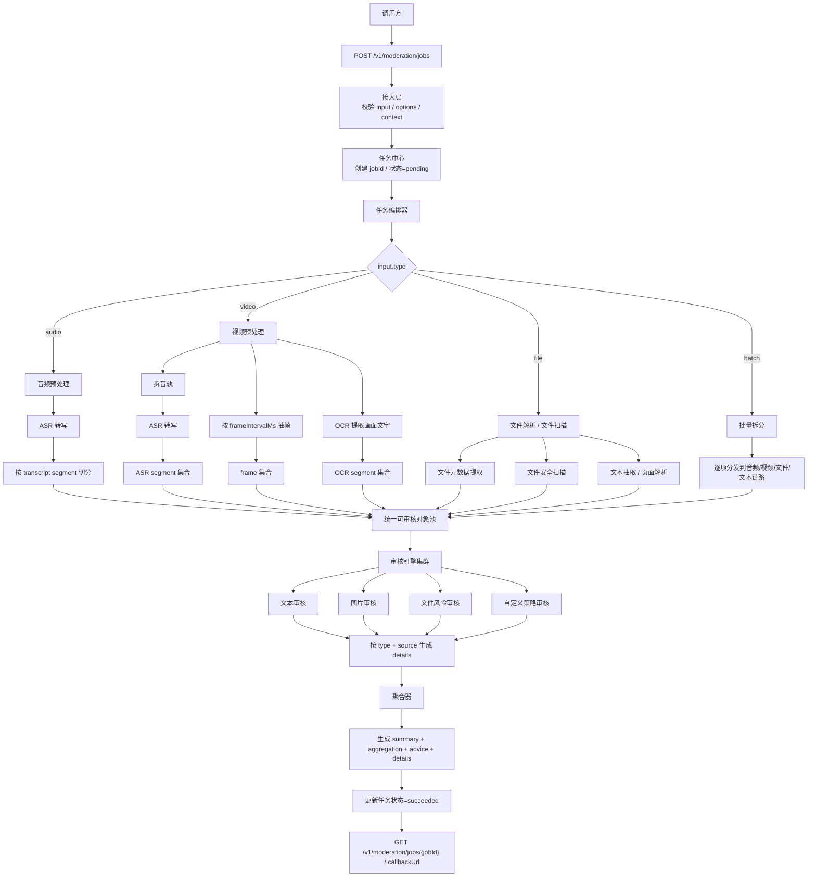
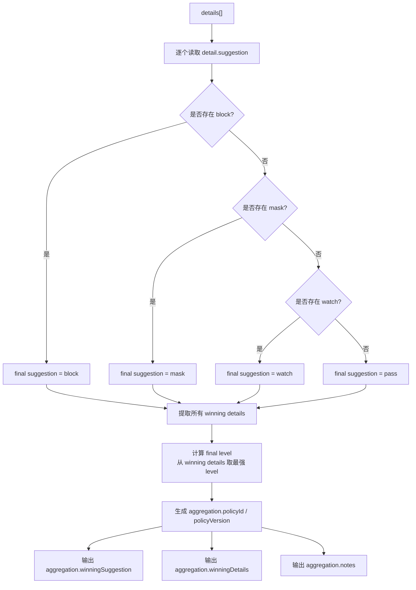
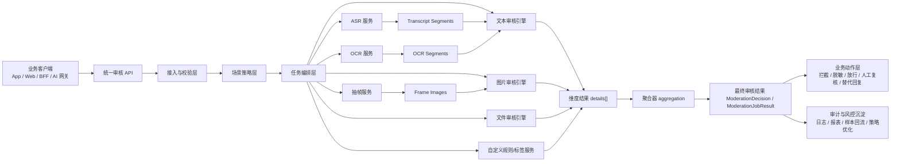
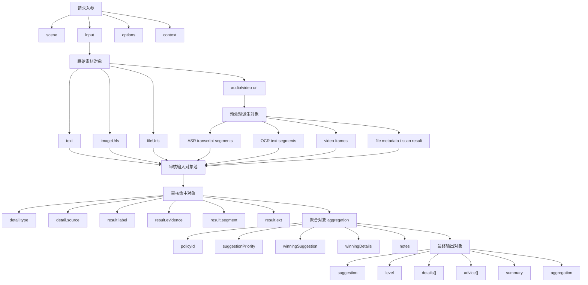

# 统一审核 API 业务流程图与数据流转图

本文基于 [moderation-openapi.yaml](/Users/kelly/Documents/test/adreview-platform/docs/moderation-openapi.yaml) 的现有接口设计整理，目标是把“谁发起、谁处理、产出什么、怎么聚合”讲清楚，便于产品、研发、审核策略、平台治理一起评审。

## 1. 业务总览树状图

## 2. 业务决策树

## 3. 同步审核详细流程图

## 4. 异步媒体审核详细流程图

## 5. 结果聚合规则图

## 6. 数据流转图

## 7. 数据对象流转图

## 8. 角色与职责图

```mermaid
flowchart TB
    A["调用方业务系统"] --> A1["选择 scene"]
    A --> A2["上传或引用素材"]
    A --> A3["消费 suggestion 并执行业务动作"]

    B["统一审核 API"] --> B1["参数校验"]
    B --> B2["能力路由"]
    B --> B3["结果统一建模"]

    C["媒体预处理服务"] --> C1["ASR"]
    C --> C2["OCR"]
    C --> C3["抽帧"]
    C --> C4["文件解析"]

    D["审核引擎"] --> D1["内容合规"]
    D --> D2["提示词攻击"]
    D --> D3["敏感信息"]
    D --> D4["恶意文件/链接"]
    D --> D5["自定义标签"]

    E["聚合器"] --> E1["按优先级选 suggestion"]
    E --> E2["确定 winning details"]
    E --> E3["输出 aggregation"]

    F["审核运营/策略团队"] --> F1["配置 scene 策略"]
    F --> F2["观察误杀漏杀"]
    F --> F3["回流样本优化规则"]
```

## 9. 研发落地建议

- 同步接口和异步接口要共用同一套 `ModerationDecision` / `ModerationDetail` / `ModerationResult` 领域模型。
- 音视频链路不要直接把原始媒体作为“审核结果”，而要先转成 transcript、OCR、frame 这些可审核对象。
- `source` 和 `segment` 在媒体场景里必须保留，否则最终结果不可解释。
- `aggregation` 不应只停留在文档说明里，必须真实出现在返回结构中，方便审计、排障和人工复核。
- 业务方真正执行动作时应优先看 `suggestion`，自动化规则优先看 `label`，运营解释再看 `description`。
