# AdReview · 审核任务端到端全生命周期

> **范围**：一个素材包从「提交者新建」到「最终归档 / 驳回 / 撤回」走过的全部环节。
>
> **覆盖角色**：Submitter → 机审引擎 → Reviewer → MLR → Admin → Superadmin → 归档。
>
> **配套文档**：
> - 用例视图：`docs/user-use-cases.md`
> - 决策矩阵与命中公式：见本文 §10
> - 状态机：本文 §11
>
> **版本**：v1.0

---

## §0 一句话故事线

> **小李**（市场部，submitter）周五下班前提交了 12 张海报用于下周一新品发布会。
> **机审**自动扫了一遍，2 张直接 `auto_reject`（severe 命中"医疗保证"话术），1 张 `auto_approve`，剩下 9 张进入人工队列。
> **小王**（reviewer）周六值班，1 小时内批了 7 张（5 通过、2 打回让小李改）；剩 2 张命中 high 风险等级，分派给 **张老师**（mlr）终审。
> **张老师**周一上午打开系统，发现 2 张里 1 张只是文案边界问题，给了"request_changes"并圈注了第 3 行；另 1 张涉金融收益承诺，直接 reject。
> 小李下午 16:00 前把 3 张（2 reviewer 打回 + 1 mlr 打回）改完重提，全部通过，进入归档。
> 全过程在 48 小时内闭环，**24 个 AuditEvent**、**3 轮策略路由**、**2 次会签**、**5 条 Annotation** 被记录在案。

---

## §1 全生命周期泳道图（端到端）

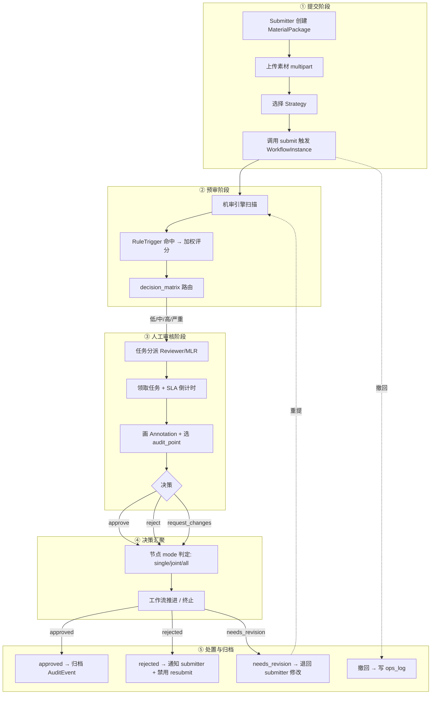

---

## §2 七幕产品故事线

| 幕 | 标题 | 核心动作 | 关键产物 |
|---|---|---|---|
| 1 | **提交与版本化** | 上传 + 选策略 + submit | `Material` + `MaterialVersion`（不可变）+ `WorkflowInstance` |
| 2 | **机审预筛** | 多模态扫描 + 加权评分 + 决策矩阵 | `RuleTrigger.hits[]` + `score_level` |
| 3 | **路由与分派** | 按 `decision_matrix` 选动作 | `ReviewTask`（assignee / sla） |
| 4 | **人审协作** | 圈注 + 选违规点 + 决策 | `Annotation[]` + `Decision` |
| 5 | **节点汇聚** | `single/joint/all` 判定 | 节点状态翻转 |
| 6 | **工作流推进** | 推进 / 终止 / 退回 | `WorkflowInstance.status` 流转 |
| 7 | **处置与归档** | 通过 → 归档 / 驳回 → 通知 / 退回 → 改 | `AuditEvent`（append-only） |

---

## §3 幕 1：提交与版本化

### 3.1 步骤流

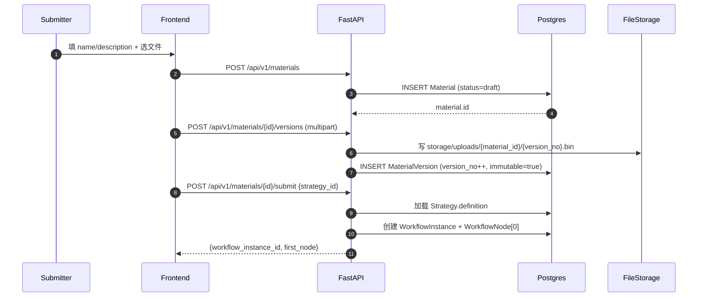

### 3.2 原理

#### 不可变版本快照（MaterialVersion.immutable）

```
version_no = MAX(material.versions.version_no) + 1
写入后 UPDATE/DELETE 一律拒绝（DB 层 CHECK + 应用层显式校验）
```

> 目的：审核与回溯必须能绑定到「具体某一版」，避免「先通过后偷改」。

#### 策略选择：默认 singleton + 自定义合并

- 默认策略 `id=default`：开箱即用，不可改结构。
- 自定义 `POST /strategies {name, application, services[]}`：后端把 `services[]` 合并进 `definition.services` JSONB。

---

## §4 幕 2：机审预筛

### 4.1 步骤流

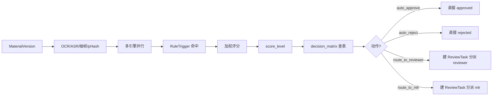

### 4.2 原理

#### 命中公式（与 §10-C 一致）

```
raw_score = Σ(item.weight × level_weight) / max(1, total_items_in_rule)

level_weight:
  low    = 1
  medium = 3
  high   = 6
  severe = 10

score_level:
  score <  2 → low
  score <  6 → medium
  score < 12 → high
  score ≥ 12 → severe

final_action = strategy.definition.decision_matrix[score_level].action
```

#### 决策矩阵（4 风险级 × 4 动作）

| 风险 \ 动作 | auto_approve | route_to_reviewer | route_to_mlr | auto_reject |
|---|:-:|:-:|:-:|:-:|
| low | ✓ | — | — | — |
| medium | — | ✓ (SLA 24h) | — | — |
| high | — | — | ✓ (SLA 8h) | — |
| severe | — | — | — | ✓ (block_resubmit) |

> 例子：小李的 12 张海报里，2 张命中「医疗保证用语」(severe) → auto_reject + 禁止重提；1 张完全干净 → auto_approve；剩 9 张路由到 reviewer/mlr。

---

## §5 幕 3：路由与分派

### 5.1 步骤流

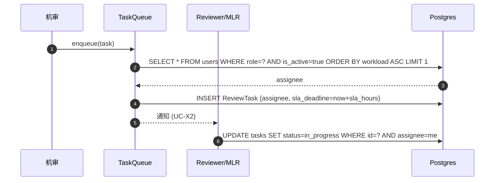

### 5.2 原理

#### 负载均衡策略（默认）

```
assignee = argmin(user.workload)
         = argmin(
             COUNT(open_tasks)
           + 0.5 × COUNT(tasks_due_in_1h)
           )
```

#### SLA 倒计时

```
sla_deadline = now() + strategy.decision_matrix[level].sla_hours × 3600
```

逾期未决策 → 自动 escalate 到 admin。

---

## §6 幕 4：人审协作

### 6.1 步骤流

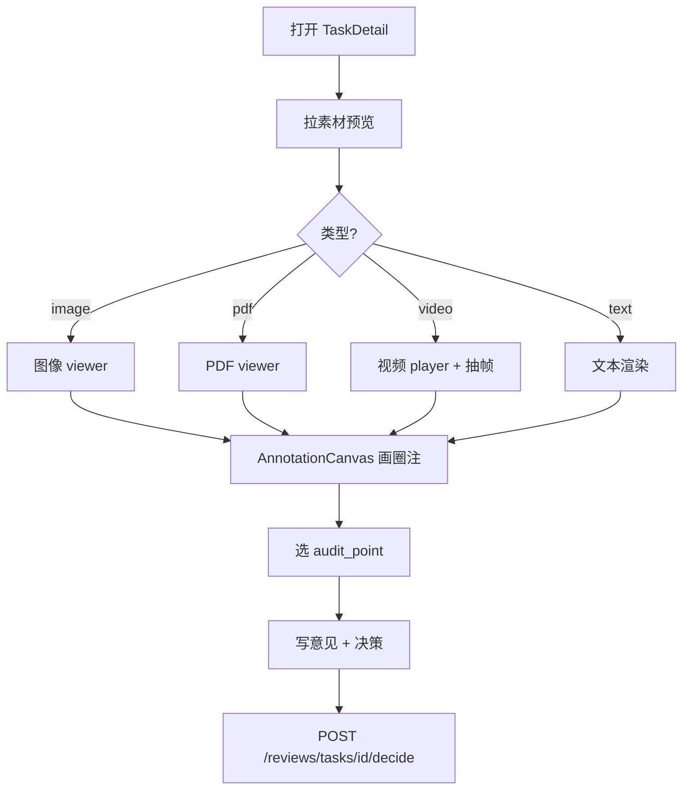

### 6.2 原理

#### Annotation 坐标归一化

```
x_norm = canvas_x / canvas_display_width   ∈ [0, 1]
y_norm = canvas_y / canvas_display_height  ∈ [0, 1]
w_norm = w / canvas_display_width
h_norm = h / canvas_display_height
```

> 目的：原始预览分辨率变化（缩放、PDF 旋转、视频帧不同尺寸）时坐标不失效。

#### 视频 / PDF 定位

```
PDF:    annotation.page       # 页码（1-indexed）
Video:  annotation.frame      # 帧号
        annotation.timestamp_ms  # 毫秒
```

#### 决策 payload

```json
POST /api/v1/reviews/tasks/{id}/decide
{
  "decision": "approve | reject | request_changes",
  "annotations": [
    { "page": 1, "x": 0.12, "y": 0.34, "w": 0.20, "h": 0.05,
      "audit_point_ids": [42, 43], "comment": "..." }
  ],
  "comments": ["总体可过，仅第 3 行需要改"]
}
```

---

## §7 幕 5：节点汇聚（WorkflowNode.mode）

### 7.1 三种模式的完成条件

```
single（单人）:
  done   = approve_count == 1  AND reject_count == 0
  failed = reject_count  == 1

joint（会签）:
  done   = approve_count == total_assignees
  failed = reject_count  ≥ 1

all（全签）:
  done   = decided_count == total_assignees
        AND winning_suggestion == approve  # 由 decision_matrix 二次裁决
  failed = 任一 reject
```

### 7.2 决策矩阵（节点模式 → 工作流流转）

| mode \ decision | approve | reject | request_changes |
|---|---|---|---|
| **single** | 节点 done → 推进 | 节点 failed → 工作流 rejected | 节点回退 → notify submitter |
| **joint** | 等所有 approve → 推进 | 任一 reject → 立即 rejected | 任一 request_changes → notify |
| **all** | 收集完意见后路由规则统一裁决 | 同 joint | 同 joint |

### 7.3 原理：会签与或签的差别

- **single** = 「或签」（任一通过即通过）
- **joint** = 「会签」（必须全部通过）
- **all** = 「全签」（收集意见后由决策矩阵二次裁决）

实现：

```sql
-- 节点完成判定（伪 SQL）
SELECT
  CASE node.mode
    WHEN 'single' THEN BOOL_AND(decision = 'approve')
    WHEN 'joint'  THEN BOOL_AND(decision = 'approve')
    WHEN 'all'    THEN COUNT(*) FILTER (WHERE decision IS NOT NULL)
                       = total_assignees
                   AND BOOL_OR(decision = 'reject') = false
                   AND strategy.decision_matrix[max(score_level)].action = 'approve'
  END AS node_done
FROM review_assignments
WHERE task_id = ?;
```

---

## §8 幕 6：工作流推进

### 8.1 步骤流

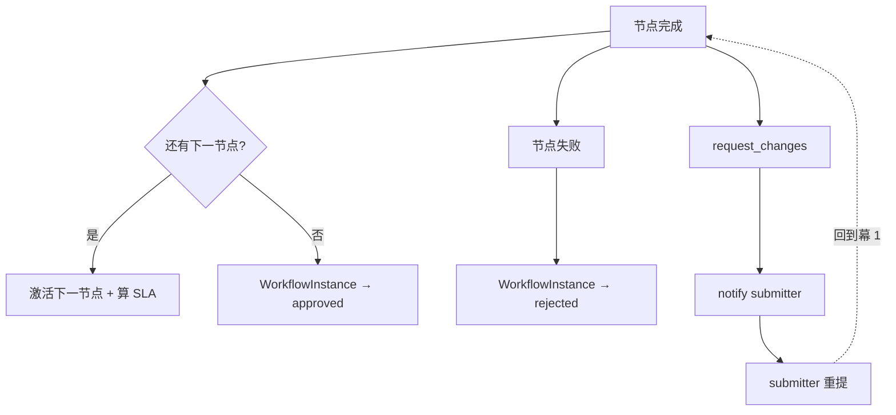

### 8.2 原理：状态机迁移

参见 §11。核心不变量：

```
WorkflowInstance.status ∈ {created, running, approved, rejected, cancelled, needs_revision}
```

迁移只能沿合法边（见 §11 mermaid stateDiagram），每次迁移写 1 条 `AuditEvent`。

---

## §9 幕 7：处置与归档

### 9.1 步骤流

| 最终态 | 动作 | 副作用 |
|---|---|---|
| `approved` | 写归档 `Archive` 记录；通知 submitter；触发 UC-A9 报表统计 | `Material.is_archived=true` |
| `rejected` | 写 `AuditEvent`；通知 submitter + admin；如 `block_resubmit=true` 则永久禁用 | `Material.status=rejected` |
| `needs_revision` | 写 `AuditEvent`；通知 submitter；submitter 修改后回到幕 1 | `WorkflowInstance.status=needs_revision` |
| `cancelled`（撤回） | 写 `ops_log`（仅 superadmin 强制 / submitter 撤回） | `Material.status=draft`（可重新 submit） |

### 9.2 原理：审计与不可篡改

```
AuditEvent:
  id            BIGSERIAL PK
  actor_id      INT FK -> users
  action        VARCHAR     # submit / decide / withdraw / archive ...
  resource_type VARCHAR     # material / task / workflow ...
  resource_id   INT
  payload       JSONB       # 决策 payload + 前后状态 diff
  created_at    TIMESTAMPTZ DEFAULT now()
```

特性：
- append-only（无 UPDATE/DELETE 权限）
- 每次状态变更必须写 1 条
- 写失败 → 整个事务回滚（保证强一致）

---

## §10 决策矩阵与命中公式（汇总）

### 10.1 Strategy.definition.decision_matrix

```json
{
  "low":    { "action": "auto_approve",     "notify": [] },
  "medium": { "action": "route_to_reviewer", "sla_hours": 24, "assignee_pool": "reviewers" },
  "high":   { "action": "route_to_mlr",      "sla_hours": 8,  "assignee_pool": "mlr" },
  "severe": { "action": "auto_reject",       "notify": ["compliance", "admin"], "block_resubmit": true }
}
```

### 10.2 命中公式

```
raw_score = Σ(item.weight × level_weight) / max(1, total_items_in_rule)

level_weight:    low=1, medium=3, high=6, severe=10

score_level:
  < 2  → low
  < 6  → medium
  < 12 → high
  ≥ 12 → severe

final_action = decision_matrix[score_level].action
```

### 10.3 节点 mode 完成条件

```
single: done = approve_count == 1 AND reject_count == 0
joint:  done = approve_count == total_assignees
all:    done = decided_count == total_assignees
            AND strategy.decision_matrix[max(score_level)].action == 'approve'
```

---

## §11 三张状态机

### 11.1 WorkflowInstance

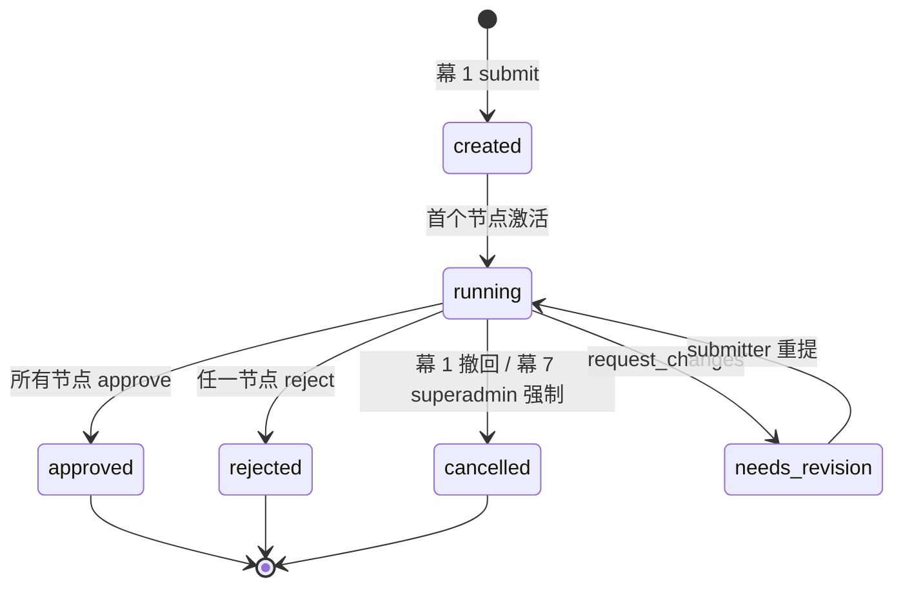

### 11.2 ReviewTask

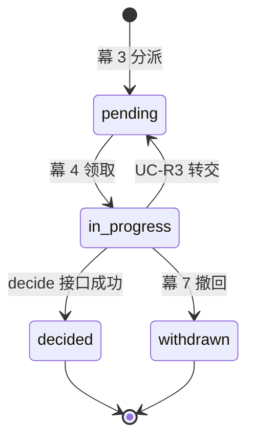

### 11.3 Material

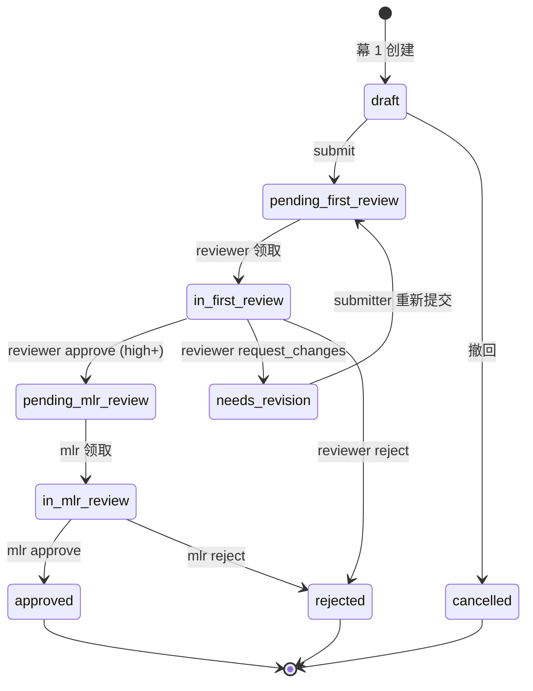

---

## §12 异常与回退路径

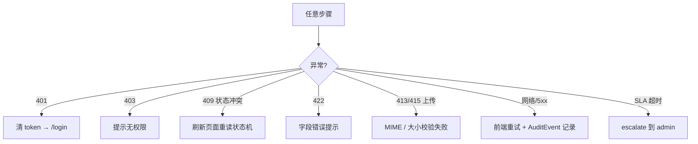

---

## §13 数据流转总览

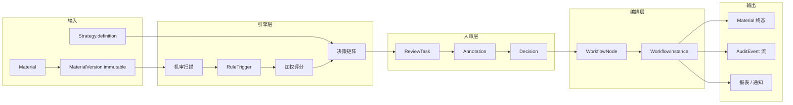

---

## §14 与用例图的对齐

| 幕 | 对应用例 |
|---|---|
| 幕 1 | UC-S1 创建素材 / UC-S4 撤回 |
| 幕 2 | UC-A3 策略 / UC-A5 规则触发器 |
| 幕 3 | UC-R1 待办列表 / UC-X2 通知 |
| 幕 4 | UC-R2 审核 / UC-R4 解决批注 / UC-S5 回复 |
| 幕 5 | UC-M1 终审 / 节点 mode 语义 |
| 幕 6 | UC-M1 / UC-R2 → 工作流推进 |
| 幕 7 | UC-A9 报表 / UC-SU1 审计 / UC-SU2 强制重置 |

---

## §15 关键不变量清单

1. `MaterialVersion` 不可变；新版本不覆盖旧版本。
2. 默认策略是 singleton（id=default）：不可删/复制/改名。
3. 状态机迁移只走合法边；非法迁移被 DB CHECK + 应用层双重拦截。
4. 每次状态变更写 1 条 `AuditEvent`（append-only）。
5. `WorkflowNode.mode` 三种语义互斥；同一节点不会混合 mode。
6. `score_level → action` 单向映射，禁止反向。
7. submitter 只能撤回 `draft` 或首个 `pending_*` 之前的素材；后续状态需 superadmin。
8. `block_resubmit=true` 的 rejected 素材永远不能重提（防止「屡败屡试」绕过）。

---

## §16 策略编辑子流程

> **范围**：创建自定义策略 / 编辑已有策略 / 重置默认策略三类操作。
> **关联用例**：`docs/user-use-cases.md` §5 UC-A3、§6 UC-SU2。
> **关联原理**：本文 §10 决策矩阵与命中公式；§11 状态机（策略编辑不影响状态机本身，仅影响路由动作）。

### 16.1 操作矩阵

| 操作 | 入口路径 | 关键 API | 触发角色 |
|---|---|---|---|
| **A. 创建自定义策略** | `/strategy/new`（`CreateStrategyPage.tsx`） | `POST /api/v1/strategies` | admin / superadmin |
| **B. 编辑已有策略** | `/strategy/:id/edit` | `PUT /api/v1/strategies/{id}` | admin / superadmin |
| **C. 重置默认策略** | `/strategy` 内"重置默认"按钮 | `POST /api/v1/strategies/default/reset` | superadmin |

### 16.2 创建策略：5 步表单（sequenceDiagram）

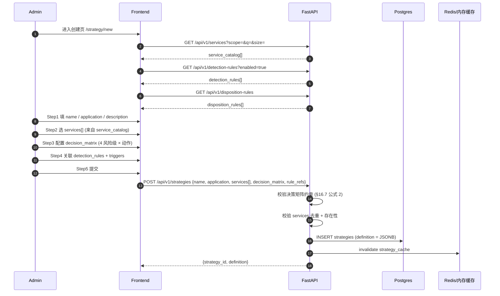

### 16.3 服务清单合并原理

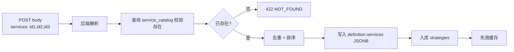

**合并公式**：

```
definition.services = unique_ordered(POST.services)
                    = sorted(set(POST.services), key=service.id)

合并模式：覆盖式（不是 union）
原因：UI 一次提交 = 一次完整定义；增量合并通过 PUT /strategies/{id} 实现
```

### 16.4 决策矩阵编辑器：约束矩阵

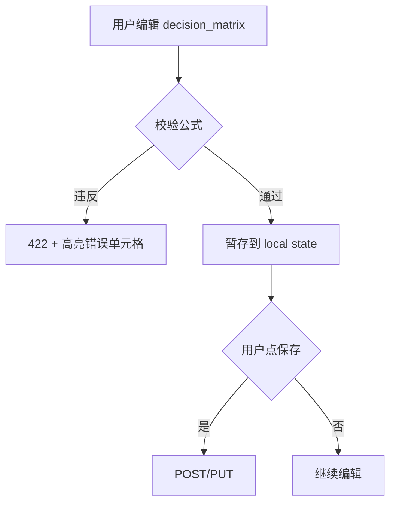

#### 合法映射表（4 风险级 × 4 动作）

| 风险 \ 动作 | auto_approve | route_to_reviewer | route_to_mlr | auto_reject |
|---|:-:|:-:|:-:|:-:|
| **low** | ✓ 必填 | ✗ | ✗ | ✗ |
| **medium** | ✗ | ✓ 必填 (SLA>0) | ✗ | ✗ |
| **high** | ✗ | ✗ | ✓ 必填 (SLA>0) | ✗ |
| **severe** | ✗ | ✗ | ✗ | ✓ 必填 (可加 block_resubmit) |

#### 校验公式

```
valid(decision_matrix) =
  AND FOR EACH level IN {low, medium, high, severe}:
       action IN allowed_actions[level]
  AND FOR EACH level WITH action == route_to_*:
       sla_hours > 0
  AND notify[] (if present) ⊆ {compliance, admin, submitter}
```

> 失败示例：`{ "low": { "action": "auto_reject" } }` → 422，错误信息：`level=low 不允许 auto_reject`。

### 16.5 编辑策略 + 影响评估 + 双轨制

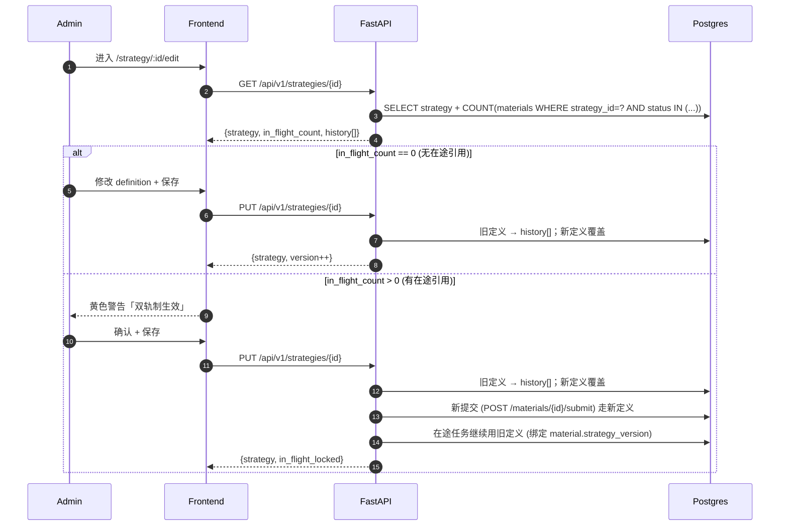

#### 影响评估公式

```
in_flight_count = COUNT(materials
                      WHERE strategy_id = :id
                      AND   status IN ('pending_first_review',
                                       'in_first_review',
                                       'pending_mlr_review',
                                       'in_mlr_review',
                                       'needs_revision'))

IF in_flight_count > 0:
    启动双轨制：
      - 旧 definition 锁定快照，挂在 material.strategy_version_snapshot
      - 在途任务继续按旧 definition 走完
      - 新提交走新 definition
ELSE:
    直接覆盖，无副作用
```

#### 版本快照（Strategy.history）

```
strategy.history[] = [
  { version: 1, definition: {...}, archived_at: T1 },
  { version: 2, definition: {...}, archived_at: T2 },
  ...
]
```

- append-only，不修改历史条目
- UI「对比 diff」按钮可任选两版本展示 JSON diff（decision_matrix / services / rule_refs）

### 16.6 重置默认策略（superadmin）

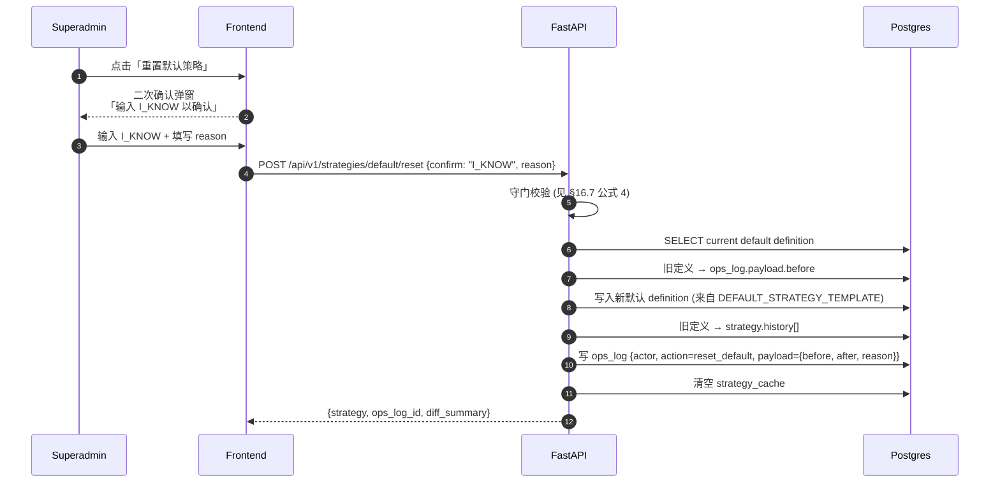

#### 重置后的传播

```
新提交 → 立即用新 default definition
在途任务 → 默认策略视为「开箱即用」，无 in_flight 锁定
（default 没有 history；reset 只是覆盖 + 写 ops_log）
```

### 16.7 策略编辑权限矩阵

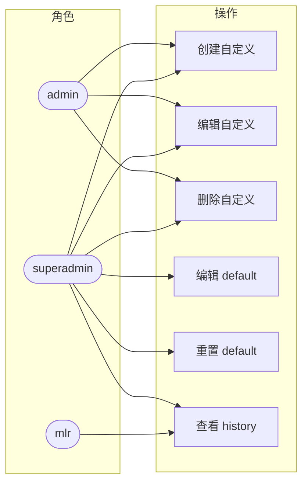

> mlr 仅可读 history（用于追溯策略变更如何影响过往决策），不能改任何策略。

### 16.8 原理汇总（5 条公式）

#### 公式 1：服务合并

```
definition.services = sorted(set(POST.services), key=service.id)
```

- 模式：覆盖式（一次 POST = 完整定义）
- 去重键：`service.id`
- 失败：任一 id 不在 service_catalog → 422 NOT_FOUND

#### 公式 2：决策矩阵约束

```
valid(dm) =
  AND dm.low.action    == 'auto_approve'
  AND dm.medium.action == 'route_to_reviewer' AND dm.medium.sla_hours > 0
  AND dm.high.action   == 'route_to_mlr'      AND dm.high.sla_hours   > 0
  AND dm.severe.action == 'auto_reject'
  AND dm.*.notify ⊆ {compliance, admin, submitter}
```

#### 公式 3：影响评估 + 双轨制

```
in_flight_count = COUNT(materials
                      WHERE strategy_id = :id
                      AND   status IN ('pending_first_review', 'in_first_review',
                                       'pending_mlr_review',  'in_mlr_review',
                                       'needs_revision'))

双轨制 = in_flight_count > 0
旧 definition → material.strategy_version_snapshot (锁定)
新定义覆盖；新提交走新；旧任务走旧
```

#### 公式 4：默认策略重置守门

```
allow_reset = (user.role == 'superadmin')
           AND (POST.confirm == 'I_KNOW')
           AND (POST.reason.length >= 10)

成功后:
  ops_log.payload = { before: old_definition, after: new_definition, reason }
  strategy.history ← old_definition
```

#### 公式 5：版本快照

```
strategy.history = append_only([
  { version, definition, archived_at },
  ...
])

UI: diff(version_a, version_b) → JSON diff（聚焦 decision_matrix / services / rule_refs）
```

### 16.9 与其他文档的引用

| 主题 | 见 |
|---|---|
| 用例 UC-A3 / UC-SU2 | `docs/user-use-cases.md §5` / `§6` |
| 决策矩阵定义（low/medium/high/severe × 4 动作） | 本文 §10-A |
| 命中公式（机审 → score_level → action） | 本文 §10-C |
| 状态机迁移规则 | 本文 §11 |
| 不变量清单（默认 singleton / 状态机合法边 / 审计 append-only） | 本文 §15 |

### 16.10 策略编辑不变量（增量）

9. 自定义策略可被任意 admin 删除，但删除前必须校验 `in_flight_count == 0`；否则 409。
10. 默认策略不可删除 / 不可复制；只能重置（覆盖 + ops_log）。
11. `decision_matrix` 任一字段更新都触发 `strategy.version++` 与 history 追加。
12. `services[]` 必须非空；空数组 → 422。
13. 同一 admin 在 60s 内对同一 strategy 的 PUT 请求串行化（防抖），避免并发覆盖导致 history 错乱。

---

**变更记录**

| 版本 | 日期 | 变更 |
|---|---|---|
| v1.0 | 2026-07-13 | 初版：7 幕产品故事线 + 端到端泳道 + 3 张状态机 + 决策矩阵 / 命中公式汇总 |
| v1.1 | 2026-07-13 | 追加 §16 策略编辑子流程：6 张 mermaid + 5 条公式 + 5 条不变量 |