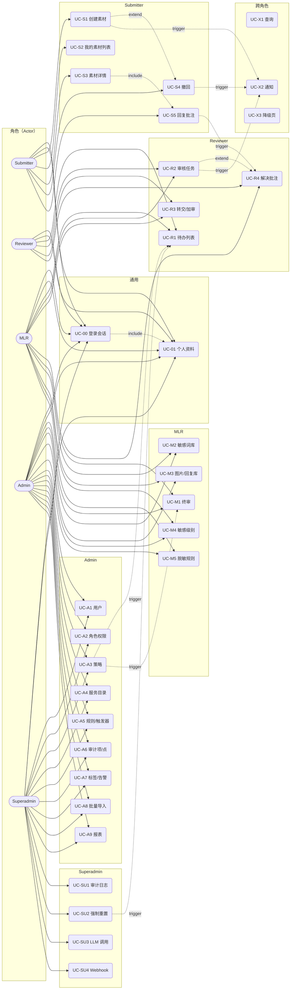
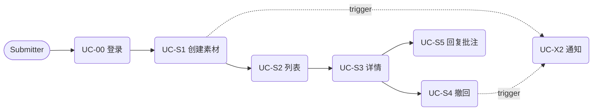
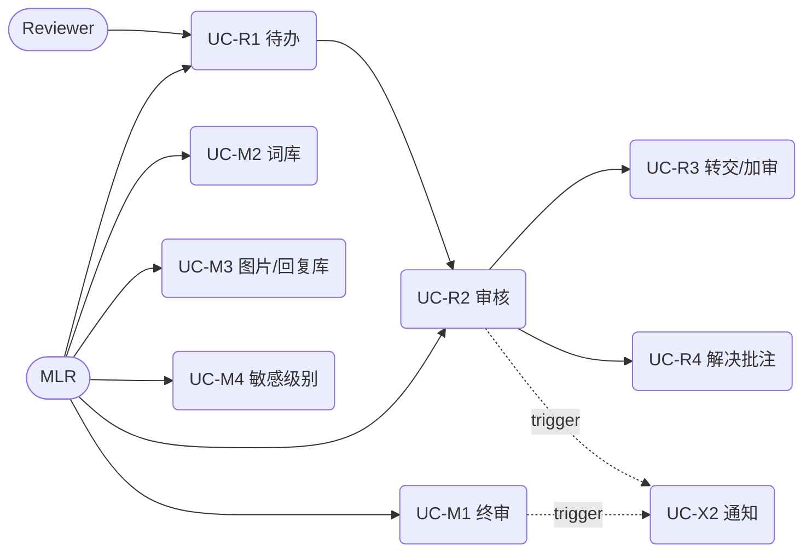
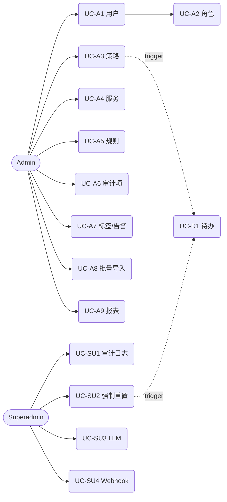
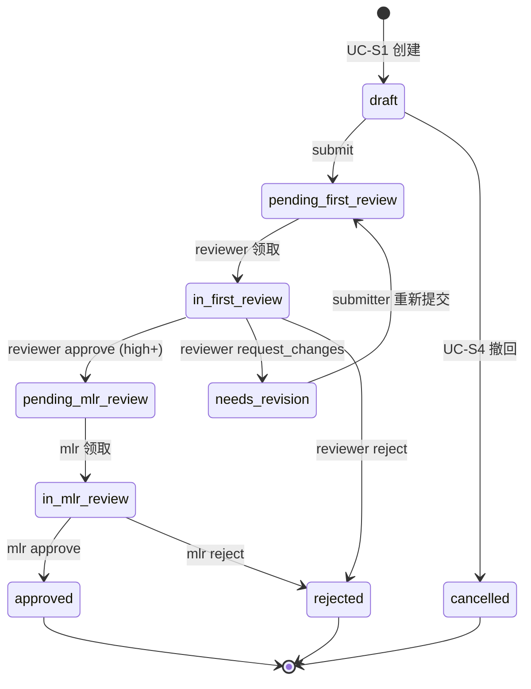
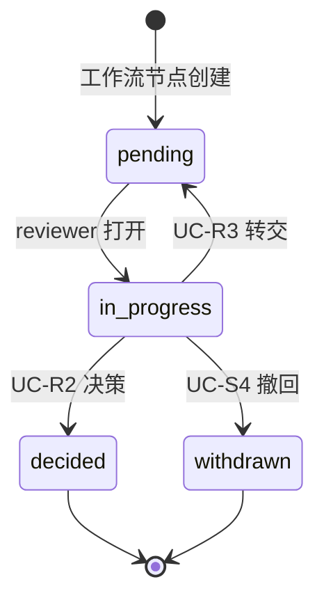
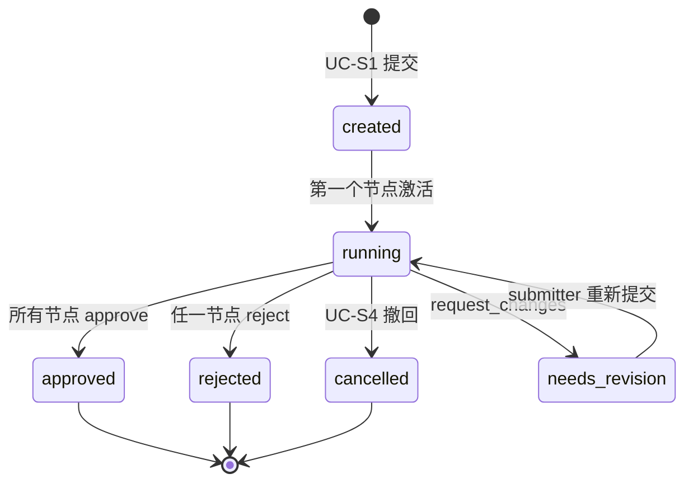

# AdReview · 用户用例图与操作手册

> 本文档覆盖 5 个角色的全部用例、步骤级操作、关联 API，以及支撑用例的原理说明（决策矩阵、命中公式、状态机）。
>
> **版本**：v1.0  
> **配套文件**：`docs/design-system.md`、`docs/import-rules.md`、`docs/webhook-integration.md`  
> **API 基准**：`docs/moderation-openapi.yaml`

---

## §0 角色与权限矩阵

### 0.1 角色定义

| 角色 | 枚举值 | 中文释义 | 主要职责 |
|---|---|---|---|
| Submitter | `submitter` | 提交者 | 创建/上传/提交审核素材，跟踪自己素材的进度 |
| Reviewer | `reviewer` | 审核员 | 处理分派给自己的初审任务 |
| MLR | `mlr` | 合规专家（Medical-Legal-Regulatory） | 终审、敏感词库、合规分级 |
| Admin | `admin` | 管理员 | 用户/角色、策略、规则、库、报表 |
| Superadmin | `superadmin` | 超级管理员 | 审计日志、LLM 调用、Webhook、强制重置 |

> 角色定义见 `backend/app/models/user.py:15` 的 `UserRole` 枚举。

### 0.2 权限判定伪公式

路由守卫（前端 `RequireRole` + 后端 `Depends(require_role)`）采用同一套判定：

```
allow = (user.role in route.allowed_roles)
     AND (resource.owner_id == user.id
          OR user.role in {admin, mlr, superadmin})
```

资源级例外：
- **用户/角色管理**：`admin` 可读写所有用户，但**不能**创建/降级 `superadmin`。
- **默认策略**：singleton（`id=default`），所有角色可读，仅 `superadmin` 可重置。
- **敏感级别 / 脱敏规则**：`mlr / admin / superadmin` 可读；`mlr / admin` 可写。
- **审计日志 / ops_log / llm_call**：仅 `superadmin` 可读。

### 0.3 角色 × 模块访问矩阵

| 模块 | Submitter | Reviewer | MLR | Admin | Superadmin |
|---|:-:|:-:|:-:|:-:|:-:|
| 素材（自己） | RW | R | R | RW | RW |
| 素材（他人） | — | — | R | RW | RW |
| 审核任务（分派给我） | — | RW | RW | RW | RW |
| 审核任务（全部） | — | — | R | RW | RW |
| 批注 | RW（自己素材） | RW（自己任务） | RW | RW | RW |
| 策略 | R | R | RW | RW | RW（+重置） |
| 服务目录 | R | R | R | RW | RW |
| 检测规则 / 触发器 / 处置 / 规则集 | — | — | R | RW | RW |
| 审计项 / 审计点 | — | — | RW | RW | RW |
| 词库 / 图片库 / 回复库 | — | — | RW | RW | RW |
| 敏感级别 / 脱敏 | — | — | RW | RW | RW |
| 标签 / 告警 | R | R | R | RW | RW |
| 用户管理 | — | — | — | RW | RW |
| 角色权限配置 | — | — | — | RW | RW |
| 批量导入 | — | — | — | RW | RW |
| 报表 | — | R | RW | RW | RW |
| 审计日志 / ops_log / LLM 调用 | — | — | — | — | R |
| Webhook | — | — | — | — | RW |

> R = 读；W = 写；— = 不可见。

---

## §1 通用用例

### UC-00 登录与会话

| 字段 | 内容 |
|---|---|
| 角色 | 全部 |
| 入口 | `/login`（`frontend/src/pages/auth/LoginPage.tsx`） |
| 触发 | 页面初始化时 `useAuthStore.fetchMe()` 返回 401，或 `localStorage` 无 token |
| 前置 | 邮箱后缀必须 `.example.com`（pydantic[email] 拒绝 `.local`）；密码 ≤ 72 字节（bcrypt 限制） |
| 步骤 | 1. 用户输入邮箱 + 密码 → 提交表单<br>2. `POST /api/v1/auth/login`（form-data：username, password）<br>3. 后端 bcrypt 校验 → 签发 JWT（`JWT_ACCESS_TTL_MIN=10080` = 7 天）<br>4. 前端写入 `localStorage.adreview.token` 与 `adreview.token_expires_at = Date.now() + 7d`<br>5. `useAuthStore.setUser()` 缓存 user → 跳转来源页或 `/` |
| 异常 | 401 → 提示"邮箱或密码错误"；422 → 字段缺失/格式错 |
| 会话刷新 | 每次路由切换 `fetchMe()`：<br>① `Date.now() > token_expires_at` → 自动 logout → `/login`<br>② 接口返回 401 → 自动 logout → `/login` |

> 关联模型 `app/models/user.py`，关联端点 `app/api/v1/auth.py`。

### UC-01 查看/修改个人资料、退出

| 字段 | 内容 |
|---|---|
| 角色 | 全部 |
| 入口 | 顶栏头像下拉（`AppLayout.tsx`） |
| 步骤 | 1. `GET /api/v1/auth/me` 拉取当前用户<br>2. 修改 `full_name` → `PATCH /api/v1/auth/me`<br>3. 点击退出 → 清 `localStorage.adreview.*` → `useAuthStore.logout()` → 跳 `/login` |
| 关系 | ← include UC-00（依赖会话） |

---

## §2 Submitter（提交者）用例

### UC-S1 创建素材包

| 字段 | 内容 |
|---|---|
| 入口 | `/packages/new`（`pages/packages/CreateTaskPage.tsx`） |
| 触发 | 用户点击"新建素材包" |
| 前置 | 已登录；草稿状态；当前用户 `role in {submitter, admin, superadmin}` |
| 步骤 | 1. 填写 `name`、`description`<br>2. 上传文件（海报/视频/PDF/文案）→ `POST /api/v1/materials/{id}/versions`（multipart）<br>3. 选择审核策略：默认 singleton / 自定义 `POST /api/v1/strategies`<br>4. 提交审核 → `POST /api/v1/materials/{id}/submit {strategy_id}`<br>5. 系统创建 `WorkflowInstance`，触发 `WorkflowNode[0]`（机审或初审） |
| 不变量 | 每次上传生成**不可变** `MaterialVersion.version_no`（单调递增）；旧版本保留用于回溯 |
| 异常 | 413 文件超限；415 MIME 不在 `STORAGE_ALLOWED_MIME`；409 已有同名进行中 |
| 关系 | → trigger UC-X2（通知分派审核员） |

### UC-S2 我的素材列表

| 字段 | 内容 |
|---|---|
| 入口 | `/materials`（`pages/materials/MaterialsListPage.tsx`） |
| 步骤 | 1. `GET /api/v1/materials?owner=me&status=&strategy_id=&page=&size=`<br>2. 表格列：缩略图 / 名称 / 当前状态 / 策略 / 风险等级 / 当前节点 / SLA 倒计时 / 提交时间<br>3. 点击行 → `/materials/:id` |
| 过滤维度 | 状态、提交时间区间、策略名、风险等级 |

### UC-S3 素材详情与进度

| 字段 | 内容 |
|---|---|
| 入口 | `/materials/:id`（`pages/materials/MaterialDetailPage.tsx`） |
| 步骤 | 1. 加载 `Material` 元信息 + 最新 `MaterialVersion`<br>2. `GET /api/v1/materials/{id}/versions/{v}/download` 拿原文件 / 缩略图<br>3. `GET /api/v1/workflows/instances/{id}` 拿工作流节点 + 当前审核员<br>4. `GET /api/v1/annotations?material_version_id=...` 拿批注列表<br>5. 如状态允许（`pending_*` 之前）→ 可"重新上传"→ 创建新版本 |
| 关系 | ← include UC-S5（查看批注并回复） |

### UC-S4 撤回 / 重新提交

| 字段 | 内容 |
|---|---|
| 前置 | 状态机当前位置 ∈ {`draft`, `pending_first_review` 之前} |
| 步骤 | 1. `POST /api/v1/materials/{id}/withdraw {reason}` → 工作流置 `cancelled`<br>2. 写 `AuditEvent`（记录操作者、时间、原因）<br>3. 用户可修改后再次 `POST /materials/{id}/submit` |
| 关系 | → trigger UC-X2（通知审核员撤回） |

### UC-S5 回复批注

| 字段 | 内容 |
|---|---|
| 入口 | 素材详情页"批注"标签 |
| 步骤 | 1. 选择批注 → `POST /api/v1/annotations/{id}/comments {text}`<br>2. 批注状态变为 `awaiting_reviewer`（由 reviewer 在 UC-R4 中 resolve） |
| 关系 | ← extend UC-R4（reviewer resolve） |

---

## §3 Reviewer（审核员）用例

### UC-R1 待办任务列表

| 字段 | 内容 |
|---|---|
| 入口 | `/tasks`（`pages/tasks/TasksPage.tsx`） |
| 步骤 | 1. `GET /api/v1/reviews/tasks?assignee=me&status=pending`<br>2. 排序键：`sla_deadline ASC`（最紧急在前）<br>3. 表格列：缩略图 / 素材名 / 风险等级 / 命中规则数 / 当前节点 / SLA 倒计时 |
| 风险评分维度 | ① `RuleTrigger.hits` 总数<br>② 命中规则中最高 `sensitive_level`<br>③ AI 预审分（如已接入 VLM）<br>④ `MaterialVersion` 内容长度/页数 |

### UC-R2 审核单条任务

| 字段 | 内容 |
|---|---|
| 入口 | `/tasks/:id`（`pages/tasks/TaskDetailPage.tsx`） |
| 步骤 | 1. `GET /api/v1/reviews/tasks/{id}` 拉任务详情 + 关联素材 + 历史批注<br>2. 预览：图像 / PDF / 视频（按 `MaterialVersion.mime` 路由到不同 viewer）<br>3. 使用 `AnnotationCanvas` 在画布上画矩形圈注：<br>　- 坐标归一化 `x_norm = x / display_width`（0..1）<br>　- PDF：`page`；视频：`frame` + `timestamp_ms`<br>4. 选择违规点（多选 `audit_point_id[]`）<br>5. 写意见文字 → 决策<br>6. `POST /api/v1/reviews/tasks/{id}/decide {decision, annotations[], comments[]}` |
| decision 取值 | `approve` / `reject` / `request_changes` |

#### 决策矩阵（节点模式 → 流转）

| 当前节点 mode \ decision | approve | reject | request_changes |
|---|---|---|---|
| `single`（单人） | 节点完成 → 进入下一节点 | 节点失败 → 工作流置 `rejected` | 节点回退 → 通知 submitter 修改 |
| `joint`（会签） | 等所有审核员全部 approve → 进入下一节点 | 任一 reject → 立即 `rejected` | 任一 request_changes → 通知 submitter |
| `all`（全签） | 收集所有意见后由路由规则统一裁决 | 同 joint | 同 joint |

> 节点 mode 定义见 `WorkflowNode.mode`；见 §10-B。

| 异常 | 409 任务已被他人领取；422 未选违规点 |
| 关系 | → trigger UC-X2（通知 submitter）<br>← extend UC-R4（解决批注） |

### UC-R3 转交 / 加审

| 字段 | 内容 |
|---|---|
| 步骤 | 1. `POST /api/v1/reviews/tasks/{id}/transfer {to_user_id, reason}` → 替换 assignee<br>2. 或 `POST /api/v1/reviews/tasks/{id}/add-reviewer {to_user_id}` → 追加 assignee（用于 joint/all 模式）<br>3. 写 `AuditEvent` |
| 前置 | 当前用户是任务 assignee；任务状态 = `pending` |

### UC-R4 标记/解决批注

| 字段 | 内容 |
|---|---|
| 步骤 | 1. 选择批注 → `PATCH /api/v1/annotations/{id}/resolve {resolved: bool, comment?}`<br>2. 状态：`open` ↔ `resolved` |
| 关系 | ← extend UC-R2（在决策前可批量解决）<br>→ trigger UC-S5（通知 submitter 有批注更新） |

---

## §4 MLR（合规专家）用例

> MLR **继承 Reviewer 全部用例**（UC-R1 ~ UC-R4），下面仅列出增量。

### UC-M1 终审节点处理

| 字段 | 内容 |
|---|---|
| 入口 | `/tasks/:id`，仅出现在 `WorkflowNode.role == 'mlr'` 的节点 |
| 步骤 | 1. 加载历史 `MaterialVersion[]` 对比视图（diff 列表）<br>2. 调取 `AuditEvent[]` 全流程回放<br>3. 决策同 UC-R2，但若涉及 `sensitive_level == 'severe'` 必须给书面理由 |
| 关系 | → trigger UC-A8（计入报表） |

### UC-M2 敏感词库管理

| 字段 | 内容 |
|---|---|
| 入口 | `/resources/words`（`pages/strategy/WordLibraryListPage.tsx`）<br>详情：`/resources/words/:id`（`WordLibraryDetailPage.tsx`） |
| API | `GET/POST/PUT/DELETE /api/v1/libraries?type=word`<br>`GET/POST/PUT/DELETE /api/v1/libraries/{id}/items` |
| 步骤 | 1. 创建词库 `{name, sensitivity_level, scope: global\|application}`<br>2. 导入词条（CSV/JSON）→ 批量 `POST .../items`<br>3. 编辑权重、级别、启用状态 |
| 命中公式 | 见 §10-C |

### UC-M3 图片库 / 回复库管理

| 字段 | 内容 |
|---|---|
| 入口 | `/resources/images`、`/resources/replies` |
| 步骤 | 1. 上传参考图 → 计算 pHash（perceptual hash）<br>2. 相似度检索：汉明距离 ≤ 8 视为同图（默认阈值，可在词库配置）<br>3. 回复库维护"标准答复"模板，命中规则后由审核员一键采用 |
| API | `/api/v1/libraries?type=image\|reply` |

### UC-M4 敏感级别配置

| 字段 | 内容 |
|---|---|
| 入口 | `/strategy/sensitive-levels`（如未独立成页，从 admin 页进入） |
| 步骤 | 1. `GET /api/v1/sensitive-levels` 列出 4 级（`low / medium / high / severe`）<br>2. `PUT /api/v1/sensitive-levels/{id}` 修改 `weight` 与对应 `sla_hours` |
| 不变量 | 级别名称不可改；只能调权重和 SLA |

### UC-M5 脱敏规则查看

| 字段 | 内容 |
|---|---|
| API | `GET /api/v1/desensitization`（可能含 PUT 视实现） |
| 用途 | 报告导出时对手机号、身份证、邮箱、银行卡做掩码 |

---

## §5 Admin（管理员）用例

> Admin **继承 MLR 全部用例**，下面仅列出增量。

### UC-A1 用户管理

| 字段 | 内容 |
|---|---|
| 入口 | `/admin/users`（`pages/admin/UsersAdminPage.tsx`） |
| 步骤 | 1. `GET /api/v1/users?role=&q=&page=` 列表<br>2. `POST /api/v1/users {email, full_name, role, password}` 创建<br>3. `PATCH /api/v1/users/{id} {role?, is_active?}` 修改角色/停用<br>4. `DELETE /api/v1/users/{id}` 软删（`is_active=false`） |
| 角色分配矩阵 | admin 可创建 `submitter / reviewer / mlr`；**不可**创建 `superadmin`<br>admin 可改角色至上述三者；不可降级 `superadmin` |
| 异常 | 409 邮箱已存在；422 邮箱非 `.example.com` 后缀 |
| 关系 | → trigger UC-X2（欢迎邮件占位） |

### UC-A2 角色权限配置

| 字段 | 内容 |
|---|---|
| 入口 | `/admin/roles`（`pages/admin/RolesAdminPage.tsx`） |
| 步骤 | 维护 `role_permissions` 表（模块 × 角色 × 读/写） |

### UC-A3 策略管理

| 字段 | 内容 |
|---|---|
| 入口 | `/strategy`（`pages/strategy/StrategyListPage.tsx`） |
| API | `GET/POST/PUT/DELETE /api/v1/strategies` |
| 步骤 | 1. `POST /api/v1/strategies {name, application, services[]}` 创建<br>　- `services` 为服务目录 ID 数组，后端合并进 `definition.services` JSONB<br>2. `PUT /api/v1/strategies/{id}` 修改决策矩阵（见 §10-A）<br>3. `DELETE` 仅允许自定义策略 |
| **不变量** | **默认策略是 singleton**（`id=default`）：不可删、不可复制、不可改名；提交策略时可显式引用 `default` |
| 关系 | → trigger UC-R1（默认分派变化）<br>→ trigger UC-M1（终审链路变化） |

### UC-A4 服务目录

| 字段 | 内容 |
|---|---|
| 入口 | `/strategy/services` |
| API | `GET /api/v1/service-categories`<br>`GET /api/v1/services?scope=&q=&size=` |
| 用途 | 创建策略 Step 2 的可选服务清单 |

### UC-A5 检测规则 / 触发器 / 处置规则 / 规则集

| 字段 | 内容 |
|---|---|
| API | `/api/v1/detection-rules`、`/api/v1/triggers`、`/api/v1/disposition-rules`、`/api/v1/rule-sets` |
| 步骤 | 列表 → 新建 / 编辑 / 启停 → 关联到策略 |
| 关系 | → trigger UC-R2（命中后写入 `RuleTrigger.hits`） |

### UC-A6 审计项 / 审计点

| 字段 | 内容 |
|---|---|
| API | `/api/v1/audit-items`、`/api/v1/audit-points` |
| 步骤 | 维护审核员在 UC-R2 中可选的违规点列表 |

### UC-A7 标签 / 告警

| 字段 | 内容 |
|---|---|
| API | `/api/v1/tags`、`/api/v1/alerts` |
| 步骤 | 标签 CRUD；告警事件查询（命中严重风险等级时生成） |

### UC-A8 批量导入规则

| 字段 | 内容 |
|---|---|
| 入口 | `/admin/import-rules`（`pages/ImportRulesPage.tsx`） |
| 文档 | `docs/import-rules.md` |
| 步骤 | 上传 CSV/JSON → 预览变更 → 确认 → 写库；失败行写回错误报告 |

### UC-A9 报表

| 字段 | 内容 |
|---|---|
| 入口 | `/reports` |
| API | `GET /api/v1/reports/overview`（KPI 卡片：今日提交/驳回率/平均 SLA/严重风险占比）<br>`GET /api/v1/reports/audit/export.csv`（审计事件导出） |
| 关系 | ← include UC-M1 / UC-R2（决策数据汇总） |

---

## §6 Superadmin（超级管理员）用例

> Superadmin **继承 Admin 全部用例**。前端**无独立页面**，复用 admin 路由 — 仅后端鉴权差异决定能否进入特定接口。

### UC-SU1 审计日志查看

| 字段 | 内容 |
|---|---|
| 入口 | 复用 `/admin` 页面侧栏的"审计日志"入口（视图组件按 role 动态挂载） |
| 数据源 | `app/models/audit.py` 的 `AuditEvent` + `ops_log.py` |
| 步骤 | 1. 过滤：操作者 / 时间段 / 资源类型 / 动作类型<br>2. 导出 CSV |

### UC-SU2 强制重置默认策略

| 字段 | 内容 |
|---|---|
| 步骤 | 1. UI 二次确认弹窗 + 要求输入 `I_KNOW` 关键字<br>2. `POST /api/v1/strategies/default/reset {reason}`<br>3. 写 `ops_log` 记录操作者、时间、原因、变更前后快照 |
| 关系 | → trigger UC-R1（默认分派立即变化） |

### UC-SU3 LLM 调用记录

| 字段 | 内容 |
|---|---|
| 数据源 | `app/models/llm_call.py` |
| 用途 | token 用量、调用链、错误重试、成本核算 |

### UC-SU4 Webhook 管理

| 字段 | 内容 |
|---|---|
| API | `/api/v1/webhooks`（CRUD） |
| 文档 | `docs/webhook-integration.md` |
| 步骤 | 配置 URL / 签名密钥 / 订阅事件（task.assigned / task.decided / alert.fired） |

---

## §7 跨角色用例

### UC-X1 通用查询

| 字段 | 内容 |
|---|---|
| 入口 | `/query`（`pages/query`） |
| 步骤 | 多维过滤：素材 / 任务 / 规则 / 标签；字段语法 `field:value` |
| 权限 | 按 §0 矩阵自动收窄 |

### UC-X2 通知

| 字段 | 内容 |
|---|---|
| 数据源 | 后台任务 `app.tasks.background.send_notification`（占位） |
| 触发点 | 任务分派、决策完成、SLA 临近、批注更新 |
| 扩展 | 可接 Email / 企业 IM webhook（见 UC-SU4） |

### UC-X3 离线/降级页

| 字段 | 内容 |
|---|---|
| 入口 | `/feature-disabled`（`pages/FeatureDisabledPage.tsx`） |
| 触发 | 当某模块开关关闭时跳转至此 |

---

## §8 Mermaid 用例图

### 8.1 全局用例图



### 8.2 Submitter 子图



### 8.3 Reviewer / MLR 子图



### 8.4 Admin / Superadmin 子图



---

## §9 用例关系（trigger / extend / include）

| 关系类型 | 源 | 目标 | 说明 |
|---|---|---|---|
| `<<include>>` | UC-01 | UC-00 | 任何资料操作都依赖会话有效 |
| `<<include>>` | UC-S3 | UC-S5 | 详情页"批注"标签内嵌回复 |
| `<<extend>>` | UC-R4 | UC-R2 | 决策前可选批量解决批注 |
| `<<extend>>` | UC-S4 | UC-S1 | 创建后可撤回 |
| `<<trigger>>` | UC-S1 | UC-X2 | 创建后通知分派审核员 |
| `<<trigger>>` | UC-R2 | UC-X2 | 决策后通知 submitter |
| `<<trigger>>` | UC-S5 | UC-R4 | submitter 回复后通知 reviewer |
| `<<trigger>>` | UC-S4 | UC-X2 | 撤回后通知审核员 |
| `<<trigger>>` | UC-A3 | UC-R1 | 策略变更影响默认分派 |
| `<<trigger>>` | UC-A3 | UC-M1 | 策略变更影响终审链路 |
| `<<trigger>>` | UC-SU2 | UC-R1 | 强制重置默认策略后立即影响分派 |
| `<<trigger>>` | UC-M1 | UC-A9 | 终审决策计入报表 |

---

## §10 原理附录

### §10-A 决策矩阵（Strategy.definition.decision_matrix）

策略 JSONB 中维护一张风险等级 → 动作的映射：

```json
{
  "decision_matrix": {
    "low":    { "action": "auto_approve",   "notify": [] },
    "medium": { "action": "route_to_reviewer", "sla_hours": 24, "assignee_pool": "reviewers" },
    "high":   { "action": "route_to_mlr",     "sla_hours": 8,  "assignee_pool": "mlr" },
    "severe": { "action": "auto_reject",      "notify": ["compliance", "admin"], "block_resubmit": true }
  }
}
```

#### 决策矩阵（4 风险级 × 4 动作）

| 风险等级 \ 动作 | auto_approve | route_to_reviewer | route_to_mlr | auto_reject |
|---|:-:|:-:|:-:|:-:|
| low | ✓（默认） | — | — | — |
| medium | — | ✓（默认 SLA 24h） | — | — |
| high | — | — | ✓（默认 SLA 8h） | — |
| severe | — | — | — | ✓（默认 + 通知合规 + 禁止重提） |

#### 不变量

- `low` 只能映射 `auto_approve`；
- `severe` 只能映射 `auto_reject`；
- `medium` / `high` 必须映射到对应 `route_to_*`，且 `sla_hours > 0`；
- 修改后写 `AuditEvent`，旧版本进入 `Strategy.history[]`。

### §10-B 节点模式（WorkflowNode.mode）

| mode | 中文 | 语义 | 完成条件 | 失败条件 |
|---|---|---|---|---|
| `single` | 单人 | 一个审核员通过即通过 | assignee approve | assignee reject |
| `joint` | 会签 | 所有 assignee 必须全部通过 | 所有 assignee approve | 任一 reject |
| `all` | 全签 | 收集所有意见后由路由规则统一裁决 | 全部提交意见后由 `decision_matrix` 判定 | 同 joint |

```
single:  完成 = approve_count == 1          && reject_count == 0
joint:   完成 = approve_count == total      && reject_count == 0
all:     完成 = decided_count == total      && 路由规则 approve
```

### §10-C 命中公式（RuleTrigger.hits → 风险等级）

机审（OCR / 词库 / pHash / VLM）产出 `RuleTrigger.hits[]`，每条 hit 含：

```
hit = { rule_id, rule_type, weight, level, matched_items[] }
```

#### 加权评分

```
raw_score = Σ (item.weight × level_weight) / max(1, total_items_in_rule)
```

其中 `level_weight` 对应：

| sensitive_level | level_weight |
|---|---|
| low | 1 |
| medium | 3 |
| high | 6 |
| severe | 10 |

#### 阈值映射

```
score_level =
   score <  2  → low
   score <  6  → medium
   score < 12  → high
   score ≥ 12  → severe
```

#### 最终动作

```
final_action = strategy.definition.decision_matrix[score_level].action
```

### §10-D Material 状态机



### §10-E ReviewTask 状态机



### §10-F WorkflowInstance 状态机



---

## §11 附录：API 端点速查

| 模块 | 端点 | 角色 |
|---|---|---|
| 认证 | `POST /api/v1/auth/login` · `POST /api/v1/auth/refresh` · `GET /api/v1/auth/me` | 全部 |
| 用户 | `GET/POST /api/v1/users` · `PATCH /api/v1/users/{id}` · `DELETE /api/v1/users/{id}` | admin+ |
| 素材 | `GET/POST /api/v1/materials` · `GET/PATCH /api/v1/materials/{id}` · `POST /api/v1/materials/{id}/versions` · `POST /api/v1/materials/{id}/submit` · `POST /api/v1/materials/{id}/withdraw` | submitter / admin+ |
| 审核 | `GET /api/v1/reviews/tasks` · `GET /api/v1/reviews/tasks/{id}` · `POST /api/v1/reviews/tasks/{id}/decide` · `POST /api/v1/reviews/tasks/{id}/transfer` · `POST /api/v1/reviews/tasks/{id}/add-reviewer` | reviewer+ |
| 批注 | `GET/POST /api/v1/annotations` · `POST /api/v1/annotations/{id}/comments` · `PATCH /api/v1/annotations/{id}/resolve` | 全部 |
| 工作流 | `GET /api/v1/workflows/templates` · `GET /api/v1/workflows/instances/{id}` | 全部 |
| 策略 | `GET/POST /api/v1/strategies` · `GET/PUT/DELETE /api/v1/strategies/{id}` · `POST /api/v1/strategies/default/reset` | admin+ |
| 服务 | `GET /api/v1/service-categories` · `GET /api/v1/services` | 全部 / admin+ |
| 规则 | `/api/v1/detection-rules` · `/api/v1/triggers` · `/api/v1/disposition-rules` · `/api/v1/rule-sets` · `/api/v1/audit-items` · `/api/v1/audit-points` | mlr+ |
| 库 | `/api/v1/libraries` · `/api/v1/libraries/{id}/items` | mlr+ |
| 敏感 / 脱敏 | `/api/v1/sensitive-levels` · `/api/v1/desensitization` | mlr+ |
| 标签 / 告警 | `/api/v1/tags` · `/api/v1/alerts` | 全部 / admin+ |
| 报表 | `GET /api/v1/reports/overview` · `GET /api/v1/reports/audit/export.csv` | reviewer+ |
| 审计 / Ops | `/api/v1/audit` · `/api/v1/ops-log` · `/api/v1/llm-calls` | superadmin |
| Webhook | `/api/v1/webhooks` | superadmin |

---

**变更记录**

| 版本 | 日期 | 变更 |
|---|---|---|
| v1.0 | 2026-07-13 | 初版：覆盖 5 角色 × 28 用例，含决策矩阵 / 命中公式 / 3 张状态机 |