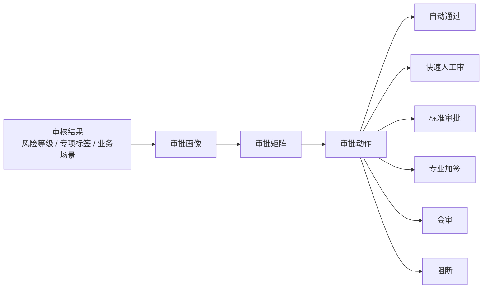

# 广宣品内容审核平台

# **广宣品内容审核平台设计**


日期：2026\-07\-01


## **1\. 项目概述**


本项目拟建设一套面向企业广宣品与营销内容智能内容审核平台。平台覆盖内容素材从提交、多模态素材解析、智能内容审核、人工审批、风险整改、发布版本锁定到复盘的完整闭环，支持通用广告、社媒种草、产品宣传、销售物料、电商详情、医药强监管内容等多类业务场景。


平台建设目标不是单纯替代人工审核，也不是只做关键词检测，而是形成一套“规则可配置、风险可解释、流程可追溯、结果可复盘”的内容合规审核基础设施。系统将内容素材、投放渠道、行业属性、产品/SKU、品牌规范、Claims、证据库、法规知识库和审批策略统一纳入审核链路，提升审核效率、降低合规风险，并支撑后续业务规模化和行业化扩展。


## **2\. 建设背景与必要性**

### 行业与监管背景

#### 监管机构多

#### 专项审核行业

#### 专项治理常态化


#### 行政处罚给企业带来的巨大损失

近几年来，监管部门对广告宣传违法行为持续保持高压态势，处罚呈现**罚款金额提高、行业监管趋严、主体责任强化、信用惩戒叠加**等特点。尤其在**医疗医美、药械、保健食品、金融理财、直播电商**等高风险领域，一次违规即可引发高额罚款、停业整改、产品下架、直播暂停、许可证风险及品牌信誉受损等连锁影响。随着《广告法》《互联网广告管理办法》《消费者权益保护法》等法规不断完善，以及跨部门联合执法机制的推进，企业广宣审核已从单纯法律合规升级为企业风险管理的重要环节，建立覆盖文案、素材、直播、电商、AI生成内容等全流程审核机制，已成为降低行政处罚和经营风险的关键措施。

#### 企业审核痛点

企业广宣内容发布渠道持续增多，内容形态从传统文案扩展到图文、海报、短视频、直播切片、PPT、PDF、二维码活动页等多模态素材。不同渠道和行业规则叠加后，人工审核面临明显压力：


- 内容量增长快，人工审核易出现排队、超时和尺度不一致。

- 渠道规则、行业法规、企业品牌规范分散维护，审核依据不统一。

- 产品 Claim、功效表达、环保/安全/医药等表述需要证据支持，人工追溯成本高。

- 医药、医疗器械、食品、金融等强监管场景需要更严格的审批链路和版本锁定。

- 审核结果往往停留在结论层，缺少风险位置、规则依据、证据版本和审批记录的完整追溯。

- 质检结果难以反向沉淀为规则、知识库、话术库和人员培训。


#### 竞品分析


## **3\. 建设目标**


### **3\.1 业务目标**


- 建立统一的广宣内容审核入口，覆盖线上社媒、电商广告、线下物料、私域话术和第三方合作内容。

- 建立以内容版本为核心的审核链路，确保通过版本可锁定、可发布、可追溯。

- 支持不同业务场景、行业、渠道、产品风险等级下的差异化审批。

- 支持医药等强监管场景的 SKU 合规校验、说明书边界校验、广告批准文号检查和 MLR 审批。

- 将风险点、修改建议以业务用户可理解的方式展示，降低沟通成本。

### **3\.2 产品目标**


- 建设素材中心、解析引擎、智能审核、策略配置、Claims 管理、知识库、运营分析和系统管理等核心模块。

- 支持素材解析、OCR、Logo 识别、产品图识别、二维码识别、片段定位和审核标注。

- 支持审核策略定义、Claim/Evidence 校验、风险分级、审批路由和审核报告归档。

- 支持Claims、证据、知识库、策略的版本化管理。

- 支持审核结果分析、误判漏判分析和策略优化闭环。


## **4\. 产品定位与边界**


### **4\.1 产品定位**


本平台定位为企业级广宣品内容审核平台，核心服务对象包括市场、品牌、销售、法务合规、审核团队和运营管理员。


### **4\.2 覆盖范围**


首期重点覆盖：

- 小红书、抖音、公众号、电商详情页等线上图文广告与社媒内容。

- 品牌 Logo、产品图、标签、二维码、海报图、文档附件等典型广宣素材。

- 通用广告规则、平台规则、行业规则、企业品牌规则。

- 通用消费品场景和医药强监管场景两个代表性样板。


## **5\. 核心用户与业务流程**


|角色|核心职责|
|---|---|
|内容提交人|创建内容、上传素材、选择场景/渠道/产品、根据建议修改|
|初审员|查看 AI 风险点、规则命中、素材标注，形成初审意见|
|专项审核人|审核说明书边界、产品合规信息|
|法务/合规审核人|审核广告法、平台规则、广告批准文号、合规风险|
|审核主管|查看队列、风险分布、审核情况|
|系统管理员|管理组织、角色、权限、审计日志、审核策略、审批|


业务流程

```mermaid
flowchart TD
    A["提交广宣品内容"] --> B["补齐业务上下文"]

    B --> B1["品牌 / 业务线"]
    B --> B2["产品 / SKU / 资质"]
    B --> B3["行业 / 渠道 / 场景"]
    B --> B4["发布目的 / 地区 / 人群"]

    B1 --> C["生成审核任务 Review Case"]
    B2 --> C
    B3 --> C
    B4 --> C

    C --> D["素材解析与内容结构化"]

    D --> D1["文本"]
    D --> D2["视频/直播 "]
    D --> D3["图片"]
    D --> D4["音频"]
    D --> D5["文档"]

    D1 --> E["选择适用策略（可自定义+策略可组合）"]
    D2 --> E
    D3 --> E
    D4 --> E
    D5 --> E

    E --> E1["合规准入策略"]
    E --> E2["事实审查策略"]
    E --> E3["信息质量策略"]
    E --> E4["品牌一致性策略"]
    E --> E5["发布风险策略"]

    E1 --> F["规则策略组合执行"]
    E2 --> F
    E3 --> F
    E4 --> F
    E5 --> F

    F --> F1["Point：审核点"]
    F --> F2["Rule：风险等级"]
    F --> F3["Knowledge：引用知识"]
    F --> F4["Source：来源追溯"]

    F1 --> G["生成审核结果"]
    F2 --> G
    F3 --> G
    F4 --> G

    G --> H["风险分级"]

    H --> H1{"是否命中阻断规则？"}
    H1 -- "是" --> I1["阻断发布：冻结审核"]
    H1 -- "否" --> H2{"是否高风险？"}

    H2 -- "是" --> I2["退回修改 / 补充证据 / 专业加签"]
    H2 -- "否" --> H3{"是否中风险？"}

    H3 -- "是" --> I3["进入标准人工审核"]
    H3 -- "否" --> H4{"是否低风险或仅提示？"}

    H4 -- "是" --> I4["快速审核 / 自动通过"]
    H4 -- "否" --> I3

    I2 --> J["审批协同路由"]
    I3 --> J
    I4 --> J

    J --> J1["市场 / 业务审核"]
    J --> J2["品牌 / 设计审核"]
    J --> J3["法务 / 合规审核"]
    J --> J4["专业角色审核：药学 /"]
    J --> J5["系统自动审核"]

    J1 --> K["审批结论"]
    J2 --> K
    J3 --> K
    J4 --> K
    J5 --> K

    K --> K1{"结论类型"}

    K1 -- "通过" --> L1["允许发布"]
    K1 -- "带条件通过" --> L2["按条件发布：限制渠道 / 地区 / 人群"]
    K1 -- "退回修改" --> L3["提交人修改内容"]
    K1 -- "补充材料" --> L4["补充证据 / 资质 / 授权"]
    K1 -- "阻断" --> L5["禁止发布"]

    L3 --> M["生成新内容版本"]
    L4 --> M
    M --> D

    L1 --> N["生成审核报告"]
    L2 --> N
    L5 --> N
    I1 --> N

    N --> O["归档与审计"]
    O --> O1["内容版本留痕"]
    O --> O2["规则命中记录"]
    O --> O3["审批记录"]
    O --> O4["证据引用记录"]
    O --> O5["最终发布结论"]

    O --> P["运营治理"]
    P --> P1["误判 / 漏判分析"]
    P --> P2["规则优化"]
    P --> P3["知识库更新"]
    P --> P4["词库更新"]
    P --> P5["审批效率分析"]
``````


## **6\. 产品功能**


### 6\.1 素材管理与素材识别解析

核心能力：

- 素材库：管理文本、视频、标签、Logo、产品图、二维码、海报图、附件。

- 素材上传：创建审核素材，关联品牌、渠道、行业、产品/SKU。

- **多模态**素材解析：音视频解析、Logo 识别、二维码识别、产品图文字等解析结果。

- 素材版本管理：保存原始版本、退回修改版本、最终通过版本。


多模态解析引擎：


### 6\.2 审核策略设计

广宣品审核本质：把非结构化传播内容转化为可解释、可追溯、可处置的发布决策。

在特定主体、产品、渠道、人群、地区、时间和发布目的下，判断一份内容是否满足外部规则、内部策略、事实依据、品牌要求和业务风险承受边界。

根据场景、素材、渠道、产品、行业来加载/自定义审核策略组合。


审核维度概览：

审核策略设计：

```mermaid
flowchart TD
    A["审核策略 Strategy<br/>适用范围/启用状态"] --> B["审核项引用CheckItemRef"]

    B --> C["审核项 Check Item<br/>业务检查任务"]
    C --> D["审核点<br/>PointRef"]

    D --> E["审核点 Check Point <br/>判断逻辑"]
    E --> F1["词库 Lexicon<br/>禁用词/限用词/敏感词"]
    E --> F2["列表库 List<br/>黑白名单/枚举/准入清单"]
    E --> F3["知识库 Knowledge<br/>法规/平台/企业/品牌依据"]
    E --> F4["主数据 Master Data<br/>SKU/资质/价格/活动"]
    E --> F5["证据库 Evidence<br/>Claim/检测/认证/授权"]

    A --> G["运行时策略快照<br/>Policy Execution Snapshot"]
    C --> G
    E --> G
    F1 --> G
    F2 --> G
    F3 --> G
    F4 --> G
    F5 --> G
```

风险等级定义：

审核点设计：

#### 通用广宣品审核包

## 

#### 内容风险审核包

#### 平台规则审核包

#### 品牌一致性审核包

#### 权利授权审核包


#### 行业专项审核包

#### Claim 专项审核包


### **6\.3 智能审核**


核心功能：


### **6\.4 审批配置**

审批流：



**审批矩阵设计**

允许用户根据业务场景和风险自定义审批矩阵，例如：


### **6\.5 策略中心**

核心能力：

- 审核策略配置：创建和编辑审核策略。

- 自定义图像：创建并上传黑白图片库集，用于策略配置选择。

- 自定义文本：创建并黑白名单数据集，用于策略配置选择。

- 审批配置：按风险等级、审核内容、产品类型自定义审批流。

- 策略版本管理：保留策略发布、回滚和历史验证记录。


### **6\.6  Claims 管理**


核心能力：

- Claim 管理：新增/停用/变更Claims。

- Claim 审批：新增、变更、停用 Claim 时触发审批。

- Claim 证据绑定：绑定产品/SKU、证据文件、有效期、适用渠道和适用场景。

- Claim 适用范围：维护人群、剂量、周期、场景、产品范围等边界。

### **6\.7 知识中心**

#### 知识库

#### 结构化数据库

#### 词库

词库负责识别“是否出现某类表达或对象”。

其中内容安全类可以继续拆成：

#### 清单库

清单库负责判断“是否属于允许/禁止范围”。

#### 模板库

#### 自定义库

黑库拦截，白库通过

自定义图像黑/白库

自定义文本白/黑名单库


### **6\.8 审核运营分析**

用数据分析三件事：

- 审核效率可视化（快不快）

- 审核质量可控（准不准）

- 审核瓶颈可定位（哪里卡）


核心能力：

- 分析审核效率：审核链路拆解，每段耗时和卡点分析。

- 分析审核质量：审核结果（通过/驳回/修改后通过）分布，一次通过率，复审改判率（误判识别），驳回率分析。

- 风险洞察：违规原因top分析， 审核点/关键词命中统计与分析。


### **6\.9 系统管理**

核心能力：

- 组织与角色：管理提交人、初审员、品牌审核人、药学/质管、法务/合规、审核主管、运营管理员。

- 权限配置：控制任务、素材、规则、Claims、知识库、报告和审批策略的访问权限。

- 通知：审批催办、退回通知、阻断通知、通过通知。

- 操作审计日志：记录提交、解析、标注、审核点命中、Agent 调用、审批、退回和归档。


## 7\.核心原型页面


## **8\. 示例**

### **8\.1 通用广告样板：立邦小红书图文广告**

场景特点：

- 行业：涂料。

- 渠道：小红书图文广告。

- 素材：标题、正文、标签、品牌 Logo、产品图、海报图。

- 重点风险：“低气味”“环保涂料”“耐擦洗”等声明需证据支持；“0 甲醛”“绝对环保”“行业第一”等高风险表述需阻断或加签。

审核路径：

- 默认审核链路：上下文校验、素材解析、策略选择、风险评分、审批流。

- 常规中高风险进入标准审核。

### **8\.2 医药样板：一心堂小红书图文广告**

场景特点：

- 行业：医药。

- 渠道：小红书图文广告。

- 素材：图文、Logo、OTC 产品图、标签、二维码。

- 重点风险：SKU 合规主数据、说明书边界、广告批准文号、互联网展示权限、禁用词和推荐话术。

审核路径：

- 先绑定 SKU 和产品类型。

- 校验说明书版本、批准文号、广告批准文号。

- 识别是否超说明书、是否缺少广告批准文号、是否存在用药安全风险。

- 触发高风险场景进入品牌审核、药学/质管审核、法务/合规审核。


### Agent编排核心原则：

- 确定性规则优先，不把硬规则交给 Agent 自由判断。

- Skill 负责稳定、可复用、输入输出明确的任务。

- Sub\-Agent 只处理需要独立上下文、并行专家判断、多轮分析或特殊权限的场景。

- 自然语言解释只用于展示，业务事实必须结构化落到规则命中、Claim 结论、风险等级、审批节点和审核报告。

- 医药等强监管场景中，Medical、Legal、Regulatory 可以并行判断，但最终必须按业务规则收敛为可执行结论。


建模原则：

- 审核素材通过的是具体版本，修改后必须形成新版本或重新审核。

- Claim 和 Evidence 必须版本化，审核结论需引用当时有效版本。

- 审核点命中必须保留素材位置，支持回指到文本片段、图片区域、页码、时间戳或坐标。

- 审计记录覆盖提交、解析、标注、规则命中、Agent 调用、审批、退回、发布和归档。

## **12\. 价值预期与衡量指标**


业务价值：

- 提升审核效率，降低重复人工判断。

- 降低高风险内容发布概率，增强合规管控。

- 提升审核尺度一致性，减少跨团队沟通成本。

- 将审核经验沉淀为规则、Claims、skills。

- 支撑强监管场景下的版本锁定和审计追溯。


|指标类型|指标|
|---|---|
|效率|平均出审时长、待审任务量、超时任务数、退回修改轮次|
|质量|质检正确率、误判率、漏判率、人工复核通过率|
|风险|高风险命中数、阻断数、补证据数、违规发布拦截数|
|策略|规则命中率、规则误判率、Claim 证据覆盖率、|


# 附录

## 医药行业

### 一心堂

[一心堂内容合规规范设计建议](https://my.feishu.cn/docx/S25UdGtxDoQ5KVxSNiCcPFW8n9k)

[智能纪要：一心堂内容中台方案评估会议 2026年5月20日](https://my.feishu.cn/docx/Hq4kd64kwoJbh4xnbU6coacunph)

### 涂料行业


### 参考资料

网易易盾

接口demo文档：https://support\.dun\.163\.com/documents/

https://www\.yun88\.com/product/8282\.html

https://dun\.163\.com/news/p/3d4a3fd371df464ca085e1e96e1af399

